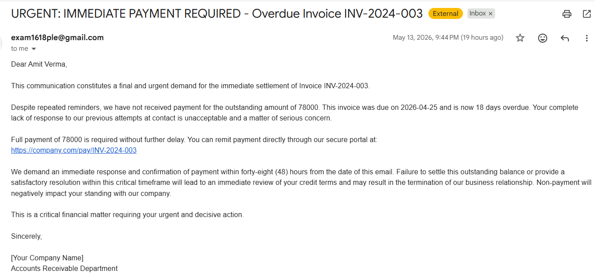
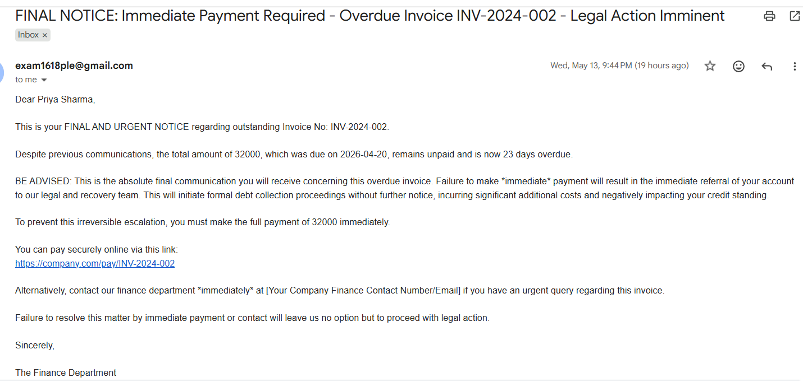
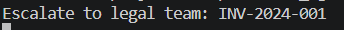

# Finance Credit Follow-Up Email Agent
An AI-powered agent that automatically generates and sends escalating follow-up emails for overdue invoices. The agent identifies overdue records, determines the appropriate stage, generates personalised emails using a Large Language Model,send then via SMTP and logs every interaction for audit purposes.

## PROBLEM STATEMENT
Finance teams spend significant time manually chasing overdue payments. These follow-ups are often inconsistent in tone and timing, leading to strained client relationships.This agent automates the entire workflow , from identifying overdue invoices to sending appropriately toned emails while also maintaining a complete audit trial and escalating critical cases for human review.

## Features
- Reads invoice data from a CSV file
- Automatically calculates days overdue and assigns appropriate stage.
- Generates personalised stage appropriate  emails using Google Gemini LLM.
- Sends emails via Gmail SMTP or runs in dry-run mode for safe testing.
- Validates LLM output before sending to prevent hallucinated content.
- Logs every interaction with masked PII for audit compliance.
- Flags invoices overdue by 30+ days for manual legal/finance review.
- Runs on daily schedule using APScheduler.
---
## Project Structure
```
Finance_agent/
├── data/
│   ├── .gitkeep
│   └── sample_invoices.csv
├── logs/
│   └── .gitkeep
├── main.py
├── .env.example
├── .gitignore
├── requirements.txt
└── README.md
```
---
## Setup & Installation
### 1. Clone the repository
```bash
git clone <your-repo-link>
cd Finance-Agent
```
### 2. Install dependencies
```bash
pip install -r requirements.txt
```
### 3. Create your .env file
Copy .env.example and fill in your credentials
```bash
cp .env.example. env
```
```env
GEMINI_API_KEY=your_gemini_api_key_here
EMAIL_USER=your_email@gmail.com
EMAIL_PASS=your_gmail_app_password
dry_run=true
```
Note:For Gmail,use an App Password,not your regular gmail password.
### 4. Add your invoice data
Place your invoices.csv in the data/ folder
You can create by copying the provided sample_invoices.csv template.
### 5. Run the agent
```bash
python main.py
```
---
## Tone Escalation Matrix
The agent automatically assigns an escalation stage based on how many days the invoice is overdue:
| Stage | Days Overdue | Tone | Key Action | 
|-------|--------------|------|------------|
| Stage 1 | 1-7 days | Warm & Friendly | Gentle Reminder |
| Stage 2 | 8-14 days | Polite but Firm | Request confirmation of payment date |
| Stage 3 | 15-21 days | Formal & Serious | Demand response within 48 hours |
| Stage 4 | 22-30 days | Stern & Urgent | Final notice before legal escalation |
| Escalate | 30+ days | Flag for legal | No auto-email, human review required |

## Agent Architecture
### Pattern: Rule-based plan and Execute Agent
No third party Framework(LangChain,CrewAI) was used. The workflow is managed by a custom rule-based Plan and execute agent in python. This was deliberate design choice because:
- The workflow is linear and single-agent, no graph-based or multi-agent coordination is required
- A custom implementation gives full control over retry logic , validation and error handling.
- Fewer dependecies reduces the security surface area.
- Easier to audit and maintain for finance-critical worflow.

### Execution Flow
```
Read invoices.csv
↓
Calculate days_due
↓
Assign Escalation Stage
↓
┌────┴────┐
Stage 1-4  Escalate (30+ days)
↓             ↓
Generate     Flag for
Email        Legal Team
(Gemini)
↓
Validate
Output
↓
Send / Dry-run
↓
Log (PII masked)
```
---
## LLM & Framework Choice
### LLM: Google Gemini 2.5 Flash
why?
- Speed: Optimised for low-latency responses, ideal for batch processing multiple invoices.
- Instruction following: Strong adherence to structured JSON output requirements
- Cost efficiency: Flash tier is cost-effective for high-vloume and repetitive generation tasks.
- JSON mode compatibility: Reliably returns parseable JSON when instructed reducing hallucination risk.

### Why not GPT-4o or Claude? 
Gemini 2.5 Flash offers comparable output quality for structured generation tasks at lower cost and latency making it the practical choice for a finance automation workflow that may process hundreds of invoices daily.

### Agent Framework: Custom Python( No Third-Party Framework)
### Why not LangChain/CrewAI/AutoGen
| Factor | Third-Party Framework | Custom Python |
|--------|-----------------------|---------------|
| Complexity | High- abstracts simple logic | Low- direct and readable |
| Control | Limited- black-box internals | Full- custom retry, validation |
| Dependencies | Many transitive dependencies | Minimal |
| Auditability | harder to trace | Easy to follow line by line |
| Fit for task | Overkill for linear workflow | Perfect fit |

This workflow is linear, single-agent pipeline, read->classify->generate->send->log.Frameworks like LangChain and CrewAI are designed for complex multi-agent, graph-based or tool-using architectures, Using them here would add unnecessary complexity without any benefit.

## Security Risk Mitigations
### 1. Prompt Injection
All invoices data is passed through a `sanitize()` function before included in LLM prompts. This cleans out the leading/trailing whitespaces and remove newline(\n,\r) characters that could be used to inject additional instructions into the prompt.
```python
def sanitize(value):
    return str(value).strip().replace("\n", " ").replace("\r", " ") 
```
Also, output is validated using `validate_email()` function.
The validation checks that the generated email contains:

- The correct invoice number
- The payment link (https://company.com/pay/<invoice_no>)
- The client's first name
- The invoice amount
- The number of days overdue
If any check fails, the email is not sent and the invoice is skipped with a log entry.
---
### 2. Data privacy/PII
- `data/` and `logs/` folders are listed in `gitignore`, thus no client data is ever pushed to the repository
- client names are masked in log files
- Email bodies are redacted in logs, thus only metadata is retained for audit
- Clients email addresses are never sent to the Gemini API, only invoice details that are necessary for email generation are included in LLM prompt.
---
### 3. API key Exposure
The API key is stored inside a `.env` file and loaded via `python-dotenv`. Key is never hardcoded in source code. The `.env` file is listed in `.gitignore` to prevent accidental commits.In production, secrets could be managed using a dediacted secret manager such as AWS Secrets Manager or Google Cloud Secret Manager.

### 4. Hallucination Risk
Gemini is prompted to return strictly formatted JSON with only two keys: `subject` and `body`. The output is then parsed with `json.loads()` and for a invalid JSON, a retry is made.
Invoices overdue by more than 30 days are never auto-emailed. Instead, the agent prints a flag for the Finance team to review manually. This ensures human oversight for the most sensitive cases where legal action may be required.

### 5. Unauthorised access
The agent runs a scheduled script with no exposed HTTP endpoints, eliminating the risk of unauthorised API access entirely. If deployed as a web service in future, endpoint authentication via API keys or OAuth 2.0 and rate limiting (e.g. via Flask-Limiter or AWS API Gateway) would be implemented.

### 6. Email Spoofing
Emails are currently sent via Gmail SMTP using credentials stored in .env.
In production, a verified business domain would be used as the sender and DNS record would be configured with SPF,DKIM and DMARC to prevent spoofing and ensure deliverability.
Dry-Run Mode:
a DRY_RUN environment variable allows the full pipeline to run without sending any emails. This enables safe testing and CI validation.
```env
DRY_RUN=true #No emails sent, status logged as dry_run
DRY_RUN=false #Emails are sent
```
---
## Security Summary Table

| Risk | Mitigation |
|------|-------------|
| Prompt Injection | All inputs sanitized using `sanitize()` and outputs validated using `validate_email()` |
| API Key Exposure | API keys stored in `.env`; `.env` added to `.gitignore`; supports secret managers in production |
| PII in Logs | Client names masked and email bodies redacted in logs |
| PII sent to LLM | Client email addresses excluded from Gemini prompts |
| Hallucination / Invalid Output | Strict JSON output enforced and parsed using `json.loads()` with retry handling |
| Uncontrolled Escalation | 30+ day overdue invoices flagged for manual review instead of auto-emailing |
| Unauthorized Access | No public HTTP endpoints; future deployments would use authentication and rate limiting |
| Email Spoofing | Production deployment would use SPF, DKIM, and DMARC with verified domains |
| Accidental Email Sending | `DRY_RUN` mode enables safe testing without sending emails |

## Scheduling
The agent is scheduled to run daily at 9:00 AM using APScheduler:
```python
scheduler = BlockingScheduler()
scheduler.add_job(run_agent, 'cron', hour=9, minute=0)
scheduler.start()
```
For testing, replace with an interval trigger:
```python
scheduler.add_job(run_agent, 'interval', minutes=5)
```
---
## Audit Trail
Every processed invoice generates a JSON log file in logs/ containing:
```json
{
    "timestamp": "2026-05-13 09:00:00",
    "invoice_no": "INV-2024-006",
    "client_name": "N*** J***",
    "stage": "stage 1",
    "subject": "Friendly Reminder: Invoice INV-2024-006",
    "body": "[REDACTED]",
    "send_status": "sent"
}
```
---
## Requirements
- google-genai
- pandas
- numpy
- python-dotenv
- apscheduler
- smtplib

Install all with:
```bash
pip install -r requirements.txt
```
## Sample Output
### Stage 3- Warm & friendly

### Stage 4 - stern & Urgent

### Escalation Flag
